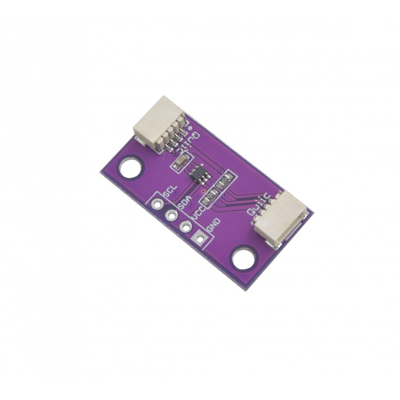

# Zio Qwiic Booster (LTC4311)

> This product can be available for purchase [here](https://www.smart-prototyping.com/Zio-Qwiic-Booster.html).

#### Description

The ZIO Qwiic Booster is a breakout for the Linear Technology LTC4311. 

The LTC4311 is a low-voltage I2C bus accelerator, dramatically reducing the transition times of the SDA and SCL signals, and enabling reliable operation of I2C interconnects over much longer cable runs than normally possible.

If you need to place your Qwiic sensor or actuator driver more than a couple of meters away from your MCU, consider using this board to ensure reliable operation. If you use Qwiic boards, or any I2C boards for that matter, in your interactive installations or other experimental hardware builds, we highly recommend having at least one of these little life-savers in your box of tricks.

#### Specification

* Dimension: 14.3x 26.5mm
* IC: LTC4311

#### Links

* [LTC4311 Datasheet](http://www.analog.com/media/en/technical-documentation/data-sheets/4311fa.pdf)

> ###### About Zio
> Zio is a new line of open sourced, compact, and grid layout boards, fully integrated for Arduino and Qwiic ecosystem. Designed ideally for wearables, robotics, small-space limitations or other on the go projects. Check out other awesome Zio products [here](https://www.smart-prototyping.com/Zio).
